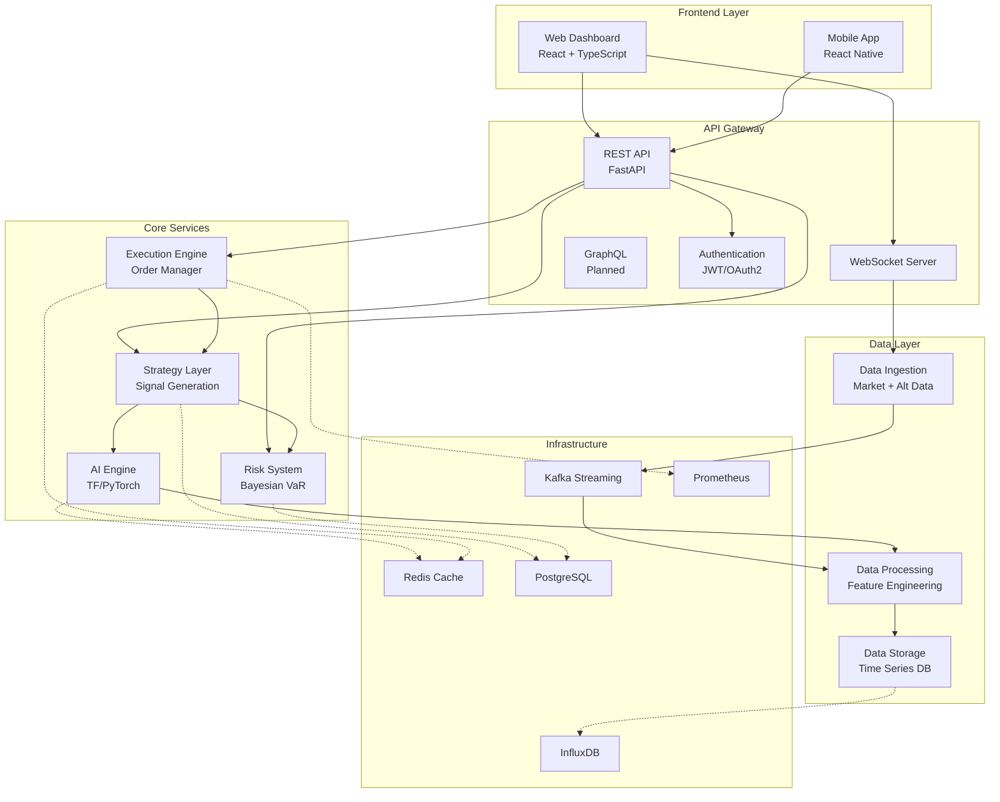
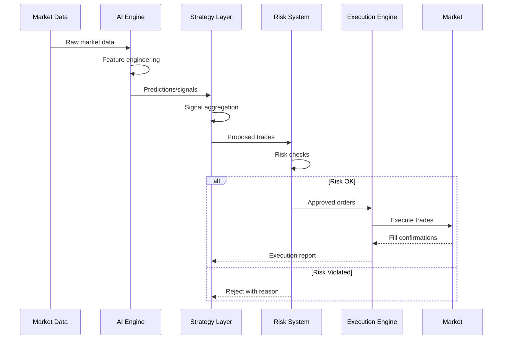

# AlphaMind Architecture

Comprehensive system architecture documentation for AlphaMind quantitative trading platform.

## Table of Contents

- [Architecture Overview](#architecture-overview)
- [System Design](#system-design)
- [Component Architecture](#component-architecture)
- [Data Flow](#data-flow)
- [Technology Stack](#technology-stack)
- [Module Mapping](#module-mapping)
- [Deployment Architecture](#deployment-architecture)

## Architecture Overview

AlphaMind follows a **microservices architecture** with event-driven communication patterns, designed for:

- **Scalability**: Horizontal scaling of independent services
- **Reliability**: Fault isolation and graceful degradation
- **Performance**: Sub-millisecond order execution
- **Flexibility**: Pluggable components and strategies

### High-Level Architecture



## System Design

### Design Principles

1. **Separation of Concerns**: Each module has a single, well-defined responsibility
2. **Event-Driven**: Asynchronous communication via message queues
3. **Stateless Services**: Horizontal scaling without session affinity
4. **API-First**: All functionality exposed via well-defined APIs
5. **Observability**: Comprehensive logging, metrics, and tracing

### Architectural Patterns

| Pattern             | Usage                      | Benefit                            |
| ------------------- | -------------------------- | ---------------------------------- |
| **Microservices**   | Service decomposition      | Independent scaling and deployment |
| **Event Sourcing**  | Order and trade history    | Audit trail and replay capability  |
| **CQRS**            | Separate read/write models | Optimized query performance        |
| **Circuit Breaker** | External API calls         | Fault tolerance                    |
| **Saga Pattern**    | Distributed transactions   | Consistency across services        |

## Component Architecture

### 1. Data Ingestion Layer

**Purpose**: Collect, validate, and normalize data from multiple sources.

```
data_ingestion/
├── market_data/
│   ├── api_connectors/          # External market data APIs
│   │   ├── alpha_vantage.py
│   │   ├── iex_cloud.py
│   │   └── polygon.py
│   ├── streaming/               # Real-time data streams
│   └── historical/              # Batch historical data
├── alternative_data/
│   ├── sentiment_analysis.py    # News/social sentiment
│   ├── sec_8k_monitor.py       # SEC filings
│   ├── satellite_processing.py  # Geospatial data
│   └── web_scrapers/           # Custom scrapers
└── data_processing/
    ├── cleaning/               # Data cleaning
    ├── validation/             # Quality checks
    └── normalization/          # Format standardization
```

**Key Files**:

- `backend/market_data/api_connectors/` - Market data integration
- `backend/alternative_data/` - Alternative data sources
- `backend/data_processing/` - ETL pipelines

---

### 2. AI Engine

**Purpose**: Train, deploy, and serve machine learning models.

```
ai_engine/
├── models/
│   ├── transformer_timeseries/     # TFT models
│   │   ├── advanced_forecasting.py
│   │   └── multi_horizon_forecast.py
│   ├── reinforcement_learning/     # RL agents
│   │   ├── ddpg_trading.py
│   │   └── sac_agent.py
│   ├── attention_mechanism.py      # Attention layers
│   └── generative_finance.py       # GAN models
├── training/
│   ├── hyperparameter_tuning.py
│   ├── cross_validation.py
│   └── model_selection.py
├── inference/
│   ├── prediction_service.py
│   └── batch_inference.py
└── registry/
    └── model_versioning.py
```

**Key Files**:

- `backend/ai_models/` - Model implementations
- `backend/ai_models/transformer_timeseries/` - Time series models
- `backend/ai_models/examples/` - Training examples

---

### 3. Strategy Layer

**Purpose**: Generate trading signals and construct portfolios.

```
strategy_layer/
├── signal_generation/
│   ├── factor_models/             # Alpha factors
│   │   └── machine_learning_factors.py
│   ├── technical_indicators.py
│   └── signal_aggregation.py
├── portfolio_construction/
│   ├── portfolio_optimization.py  # Mean-variance, etc.
│   ├── asset_allocation.py
│   └── rebalancing.py
├── backtesting/
│   ├── backtest_engine.py
│   ├── performance_metrics.py
│   └── regime_detection/
│       └── realtime_changepoint.py
└── strategy_management/
    ├── strategy_registry.py
    └── parameter_optimization.py
```

**Key Files**:

- `backend/alpha_research/` - Strategy research
- `backend/alpha_research/factor_models/` - Factor generation
- `backend/alpha_research/portfolio_optimization.py` - Portfolio construction

---

### 4. Risk Management System

**Purpose**: Monitor, measure, and manage portfolio risk.

```
risk_system/
├── measurement/
│   ├── bayesian_var.py            # Value at Risk
│   ├── stress_testing.py          # Scenario analysis
│   └── risk_metrics.py
├── monitoring/
│   ├── real_time_monitoring.py    # Live risk tracking
│   ├── position_limits.py         # Position controls
│   └── alert_system.py
├── counterparty_risk/
│   ├── credit_value_adjustment.py # CVA calculation
│   └── exposure_monitoring.py
└── aggregation/
    └── portfolio_risk.py          # Portfolio-level risk
```

**Key Files**:

- `backend/risk_system/` - Risk management
- `backend/risk_system/bayesian_var.py` - VaR calculation
- `backend/risk_system/risk_aggregation/` - Risk aggregation

---

### 5. Execution Engine

**Purpose**: Execute trades efficiently across multiple venues.

```
execution_engine/
├── order_management/
│   ├── order_manager.py           # Order lifecycle
│   ├── order_validation.py
│   ├── market_connectivity.py     # Exchange connectors
│   ├── reconnection_manager.py
│   └── strategy_selector.py
├── smart_order_routing/
│   ├── router.py                  # Smart routing logic
│   ├── venue_selection.py
│   └── latency_arbitrage.py
├── algorithms/
│   ├── twap.py                    # Time-weighted
│   ├── vwap.py                    # Volume-weighted
│   └── adaptive_execution.py
├── liquidity_forecasting.py       # Liquidity prediction
└── market_impact.py               # Impact modeling
```

**Key Files**:

- `backend/execution_engine/` - Execution logic
- `backend/execution_engine/order_management/order_manager.py` - Order manager
- `backend/execution_engine/smart_order_routing/` - Routing algorithms

---

### 6. API Gateway

**Purpose**: Expose functionality via REST, WebSocket, and GraphQL APIs.

```
api_gateway/
├── main.py                        # FastAPI application
├── routers/
│   ├── health.py                  # Health checks
│   ├── trading.py                 # Trading operations
│   ├── portfolio.py               # Portfolio management
│   ├── market_data.py             # Market data
│   └── strategies.py              # Strategy management
├── dependencies/
│   └── auth.py                    # Authentication
├── schemas/
│   └── models.py                  # Pydantic models
└── websockets/
    ├── market_data_ws.py
    └── risk_alerts_ws.py
```

**Key Files**:

- `backend/api/main.py` - API entry point
- `backend/api/routers/` - API endpoints
- `backend/api/schemas/` - Request/response schemas

---

## Data Flow

### Trading Signal Generation Flow



### Real-time Market Data Flow

```
External APIs → Kafka → Data Processing → Feature Store → AI Models
                  ↓                           ↓
              InfluxDB                    Redis Cache
                  ↓                           ↓
           WebSocket ← ─ ─ ─ ─ ─ ─ ─ ─ Web Dashboard
```

## Technology Stack

### Backend Stack

| Layer               | Technology                        | Purpose                      |
| ------------------- | --------------------------------- | ---------------------------- |
| **API**             | FastAPI, Uvicorn                  | High-performance async API   |
| **ML/AI**           | TensorFlow, PyTorch, scikit-learn | Model training and inference |
| **Data Processing** | Pandas, NumPy, Dask               | Data manipulation            |
| **Finance**         | QuantLib, zipline                 | Quantitative finance         |
| **Streaming**       | Kafka, Redis Streams              | Real-time data               |
| **Databases**       | PostgreSQL, InfluxDB, Redis       | Data persistence             |
| **Queue**           | Redis, RabbitMQ                   | Task queuing                 |

### Frontend Stack

| Component   | Technology                      | Purpose                 |
| ----------- | ------------------------------- | ----------------------- |
| **Web**     | React, TypeScript, D3.js        | Interactive dashboard   |
| **Mobile**  | React Native, Redux             | Cross-platform app      |
| **Charts**  | TradingView, Recharts           | Financial visualization |
| **Styling** | Tailwind CSS, Styled Components | UI styling              |

### Infrastructure Stack

| Component         | Technology             | Purpose                     |
| ----------------- | ---------------------- | --------------------------- |
| **Containers**    | Docker, Docker Compose | Service packaging           |
| **Orchestration** | Kubernetes, Helm       | Container orchestration     |
| **IaC**           | Terraform              | Infrastructure provisioning |
| **CI/CD**         | GitHub Actions         | Automation pipeline         |
| **Monitoring**    | Prometheus, Grafana    | Metrics and dashboards      |
| **Logging**       | ELK Stack              | Centralized logging         |

---

## Module Mapping

### Backend Module Structure

| Module               | Path                        | Responsibility         | Key Files                                     |
| -------------------- | --------------------------- | ---------------------- | --------------------------------------------- |
| **API**              | `backend/api/`              | REST/WebSocket API     | `main.py`, `routers/*.py`                     |
| **AI Models**        | `backend/ai_models/`        | ML/AI algorithms       | `ddpg_trading.py`, `transformer_timeseries/`  |
| **Alpha Research**   | `backend/alpha_research/`   | Strategy research      | `portfolio_optimization.py`, `factor_models/` |
| **Alternative Data** | `backend/alternative_data/` | Alt data processing    | `sentiment_analysis.py`, `sec_8k_monitor.py`  |
| **Core**             | `backend/core/`             | Shared utilities       | `config.py`, `logging.py`                     |
| **Data Processing**  | `backend/data_processing/`  | ETL pipelines          | Data cleaning, validation                     |
| **Execution**        | `backend/execution_engine/` | Order execution        | `order_manager.py`, `smart_order_routing/`    |
| **Infrastructure**   | `backend/infrastructure/`   | Infrastructure code    | `kafka_streaming/`, `gcp_vertex/`             |
| **Market Data**      | `backend/market_data/`      | Market data APIs       | `api_connectors/`                             |
| **Model Validation** | `backend/model_validation/` | Model validation       | Backtesting, metrics                          |
| **Risk System**      | `backend/risk_system/`      | Risk management        | `bayesian_var.py`, `risk_aggregation/`        |
| **Tests**            | `backend/tests/`, `tests/`  | Unit/integration tests | `test_*.py`                                   |

### Frontend Module Structure

| Module                | Path                      | Responsibility          |
| --------------------- | ------------------------- | ----------------------- |
| **Web Frontend**      | `web-frontend/`           | React web application   |
| **Mobile Frontend**   | `mobile-frontend/`        | React Native mobile app |
| **Shared Components** | `*/components/`           | Reusable UI components  |
| **State Management**  | `*/store/` or `*/redux/`  | Application state       |
| **API Clients**       | `*/services/` or `*/api/` | Backend integration     |

---

## Deployment Architecture

### Development Environment

```
┌─────────────────┐
│  Developer      │
│  Machine        │
├─────────────────┤
│ • Backend (venv)│
│ • Frontend (npm)│
│ • PostgreSQL    │
│ • Redis         │
│ • InfluxDB      │
└─────────────────┘
```

### Production Environment (Kubernetes)

```
┌───────────────────────────────────────┐
│           Load Balancer               │
└────────────┬──────────────────────────┘
             │
    ┌────────┴────────┐
    │   API Gateway   │
    │   (3 replicas)  │
    └────────┬────────┘
             │
    ┌────────┴────────────────────┐
    │                             │
┌───┴─────┐  ┌──────────┐  ┌─────┴────┐
│Strategy │  │AI Engine │  │ Execution│
│Service  │  │Service   │  │ Service  │
└────┬────┘  └────┬─────┘  └────┬─────┘
     │            │             │
     └────────────┴─────────────┘
                  │
        ┌─────────┴──────────┐
        │                    │
    ┌───┴────┐        ┌──────┴─────┐
    │Database│        │Time Series │
    │Cluster │        │DB (InfluxDB)│
    └────────┘        └────────────┘
```

### Cloud Architecture (GCP/AWS)

```
Internet
    ↓
Cloud Load Balancer
    ↓
┌─────────────────────────────┐
│  Kubernetes Cluster         │
│  ┌─────────┐  ┌──────────┐ │
│  │Frontend │  │  Backend │ │
│  │ Pods    │  │   Pods   │ │
│  └─────────┘  └──────────┘ │
└─────────────────────────────┘
    ↓                    ↓
┌─────────┐        ┌──────────┐
│Cloud SQL│        │  Cloud   │
│(Postgres)│        │ Storage  │
└─────────┘        └──────────┘
```

---

## Performance Considerations

### Latency Requirements

| Component            | Target Latency | Critical? |
| -------------------- | -------------- | :-------: |
| **API Response**     | < 100ms        |    ⚠️     |
| **Order Execution**  | < 10ms         |    ✅     |
| **Market Data**      | < 1ms          |    ✅     |
| **Risk Calculation** | < 50ms         |    ⚠️     |
| **Model Inference**  | < 100ms        |    ⚠️     |

### Scalability

- **Horizontal**: Services scale independently based on load
- **Vertical**: AI training requires GPU-enabled nodes
- **Auto-scaling**: Kubernetes HPA based on CPU/memory metrics

---

## Security Architecture

```
┌─────────────────────────────────┐
│   External Users/Systems        │
└────────────┬────────────────────┘
             │ HTTPS/TLS
    ┌────────┴──────────┐
    │  API Gateway      │
    │  • Rate Limiting  │
    │  • JWT Auth       │
    │  • Input Validation
    └────────┬──────────┘
             │ Internal Network
    ┌────────┴──────────┐
    │  Backend Services │
    │  • Service Auth   │
    │  • Secret Manager │
    │  • Encryption     │
    └────────┬──────────┘
             │
    ┌────────┴──────────┐
    │   Data Layer      │
    │  • Encrypted at   │
    │    rest & transit │
    └───────────────────┘
```

---

## Next Steps

- **Implementation**: See [USAGE.md](USAGE.md) for usage patterns
- **API Reference**: Check [API.md](API.md) for API details
- **Configuration**: Review [CONFIGURATION.md](CONFIGURATION.md) for setup
- **Examples**: Explore [EXAMPLES/](EXAMPLES/) for code samples
